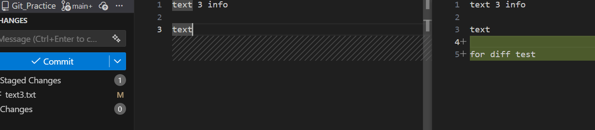

### 建立 Repository

```bash
git init
```


### 狀態查詢 status
不知道什麼狀況就打這個

```bash
git status
```


### 查詢歷史 log

```bash
#一般紀錄
git log

#僅顯示 一行
git log --oneline

#顯示圖示
git log --oneline --graph
```


### Commit 相關指令

```bash
#新增檔案
git add <檔案名稱>

#新增所有檔案
git add .

#還原檔案到上個commit(add 前)
git restore <檔案名稱>
git restore .

#還原檔案到上個commit(add 後)
git restore --staged <檔案名稱>
git restore --staged .

#建立commit
git commit -m "訊息"

#建立commit, 並直接add -u (新檔案還是得add)
git commit -am "訊息"

#修改最後一次commit 訊息
git commit --amend -m "修正訊息"

```

### 分支 Branch

```bash
#查看分支
git branch

#新增&切換分支
git switch -c <分支名稱>

#切換分支
git switch <分支名稱>

#刪除分支
git branch -d <分支名稱>

#強制刪除分支
git branch -D <分支名稱>

#切換到某個commit查看(看完再switch回來, hash可以從 log 查看)
git switch --detach <commit_hash>

```

### 合併 - Merge

```bash
#合併分支
git merge <分支名稱>

#合併分支並刪除分支
git merge -d <分支名稱>

```

### 還原Commit內容 - Reset

```bash
#後悔 commit，但內容還要
git reset --soft HEAD~1

#後悔 commit + 想重新選擇 add (reset 預設為 --mixed)
git reset HEAD~1
git reset --mixed HEAD~1

#全部不要了，回到過去()
git reset --hard HEAD~1
```

### Remote 相關

```bash
#查看有哪些remote
git remote 

#查看remote狀態
git remote -v

#下載遠端 commit 更新，但不改工作目錄
git fetch <remote名稱>

#push 推送到remote端 
git push <remote名稱> <branch名稱>
#push 推送到remote端,並設定upstream 
git push -u <remote名稱> <branch名稱>

#pull 下載remote端
git pull <remote名稱> <branch名稱>

#只要branch設定過 upstream 之後可以直接 git pull/push/fetch

#查詢upstream
git branch -vv

#手動設定upstream
git branch -u <remote名稱>/<branch名稱>

```


```bash
#git clone 等於以下指令
git init
git remote add origin <url>
git fetch origin
git checkout <default-branch>
```

```bash
#git pull 等於以下指令
git fetch
git merge origin/<current-branch>
```


### 查詢變更

git diff 

或是直接使用VScode Git 查看



**git checkout 以前什麼都做**
```bash
git checkout develop       # 換分支
git checkout -b feature    # 建分支 + 換
git checkout commit_hash   # 跳到某 commit
git checkout -- file.txt   # 還原檔案
```
**Git 2.23（2019）之後：拆開**
| 用途           | 指令                     |
|----------------|--------------------------|
| 換分支         | git switch               |
| 建立 + 換分支   | git switch -c            |
| 還原檔案       | git restore              |
| checkout（保留）| 給老手或舊文件           |
