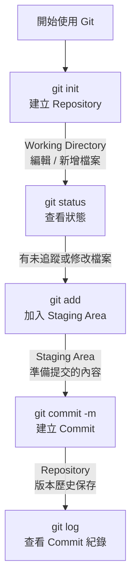

# Git 入門：從 0 到第一個 Commit

這份文件會帶你**從完全沒有 Git**，一路走到完成你的**第一個 commit**。適合：

* 剛接觸 Git 的新手
* 使用各種{copy_日期}的檔案控制版本
* 寫程式但「只會用 ZIP 檔」的人
* 想搞懂 Git 在幹嘛，而不只是背指令

---

## 什麼是 Git？

**Git 是一個版本控制系統（Version Control System）**。

白話一點說：

> Git 幫你記住「檔案每一次改了什麼、誰改的、什麼時候改的」，而且可以回到過去任何一個狀態。

你可以把 Git 想成：

* 🕰️ 時光機（可以回到過去）
* 📜 修改紀錄本（每一次改動都有記錄）
* 🤝 協作工具（多人一起改同一個專案）

---

## Git 的三個世界（很重要）

在 Git 裡，檔案會存在於三個不同的「區域」：

```
工作目錄 (Working Directory)
        ↓ git add
暫存區 (Staging Area)
        ↓ git commit
儲存庫 (Repository)
```

### 1️⃣ Working Directory（工作目錄）

* 你實際在電腦上看到、編輯的檔案
* `Ctrl + S` 只是在這裡存檔

### 2️⃣ Staging Area（暫存區）

* 你「**準備要提交**」的檔案清單
* 用來決定：哪些改動要進入這次 commit

### 3️⃣ Repository（儲存庫）

* 真正被 Git 記錄下來的歷史
* 每一次 commit 都會永久存在（除非你刻意刪）

---

最簡單的例子：
```bash
git init
git add .
git commit -m "init"
# 恭喜! 你已經完成了你的第一個 commit
```



### Commit 是什麼？

* 一個「**完整的版本快照**」
* 包含：

  * 檔案內容
  * 提交時間
  * 提交者
  * 一段說明訊息（commit message）

這一刻，你的專案歷史正式開始了。

---

## 查看 Commit 紀錄

```bash
git log
git log --oneline
git log --oneline --graph
```

你會看到：

* commit id（雜湊值）
* 作者
* 日期
* commit 訊息

Note: 按Q 可以離開 log 窗口

---

## 常見新手迷思

### ❓ 為什麼要先 git add，不能直接 commit？

因為 Git 允許你：

* 同時改很多檔案
* 只挑其中幾個放進這次 commit

這是 Git 非常強大的設計。

---

### ❓ 忘記 git add 就 commit 會怎樣？

👉 **什麼都不會發生**

* Git 會說：`nothing to commit`

---

### ❓ Commit message 要怎麼寫？

```
<type>:<一句話描述>
```
基本原則：

* 簡短
* 描述「做了什麼」

範例：

* `Initial commit`
* `feat: Add login page`
* `doc:Fix typo in README`

其他更詳細請參照
[Commit_Message](./Commit_Message.md)

--- 
### .gitignore - 不想進入Commit?

```bash
# 發現 status 中有很多不想被 add 的檔案????
git status
```


專案中不是所有的檔案都必須被記錄
除了帳密金鑰等...(但如果都在本地git或是不會散布,就不用擔心)
比如說log , package , node_modules等等
那種可以透過指令還原的,都可以透過`.gitignore`來忽略

**只要在目錄下直接建立一個`.gitignore`檔案即可**
檔案內只要新增檔案名稱或是資料夾即可,例如:

```bash
#忽略單一檔案
config.json
.env

#忽略某一類副檔名
*.log
*.tmp
*.bak

#忽略資料夾 (最常用, 結尾的 / 代表「整個資料夾」)
node_modules/
dist/
build/
__pycache__/
```

**規則比對重點（新手常踩雷）**

規則是 由上往下 比對
後面的規則可以覆蓋前面的


---
### git的資訊存放?
git 所有的訊息都放在`.git`這個隱藏的資料夾
如果你去移除他,就會失去所有的紀錄
(或是你想整個reset, 就把他刪掉 ,再重新 git init)
