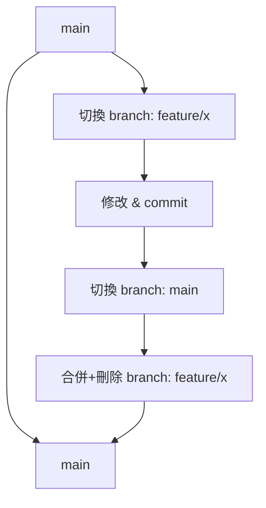

# Git 分支 (Branch) 教學
目的：
> 讓單人作業也能安全地嘗試新功能、修 bug，不破壞 main。
        就算改壞了,也能直接還原到main

---

## 為什麼要使用 Branch？

* 嘗試新功能 → 不破壞 main
* 修 bug → 隔離改動
* 整理 commit → 保持歷史乾淨

**心法口訣**：

> branch = 試驗場，main = 穩定場

**Branch 開發流程指令(回顧快速查找)**

```bash
#switch 指令 , 切換並建立Branch
git switch -c feature/x

#舊版 checkout 指令(仍然可用,舊版git 使用此指令,一般請記住switch即可)
#git checkout -b feature/x

#修改完成commit
git commit -m "feat: add export to csv"

#切回 main
git switch main

#將 feature/x 合併到 main 並刪除
git merge -d feature/x
```





## 如果改到一半,得做branch switch
1. commit 後再切換 (建議作法)

2. stash 暫存 (但不推薦 ,因為沒有commit 不可追蹤)
```bash
# stash 指令 ,暫時儲存
git stash
git switch other-branch
# 回來
git switch original-branch
git stash list
git stash pop
```

---

## 分支使用建議

* 命名技巧：

  * `feature/xxx` → 新功能
  * `fix/xxx` → 修 bug
  * `experiment/xxx` → 嘗試性修改
* 保持 main 隨時可跑
* 不要在 detached HEAD commit

## Git 分支分類一覽

| 分支名稱     | 類型     | 說明 |
|--------------|----------|------|
| `main`       | 長期分支 | 正式線（Production），每個 commit 都應可部署 |
| `develop`    | 長期分支 | 整合線，功能完成後統一合併測試 |
| `feature/*`  | 短期分支 | 新功能開發，完成後合併回 `develop` |
| `bugfix/*`   | 短期分支 | 修正尚未上線的錯誤 |
| `hotfix/*`   | 短期分支 | 緊急修正正式環境問題，通常直接影響 `main` |
| `release/*`  | 短期分支 | 發版準備（版本號、文件、最終測試） |


---
## Branch 修改到一半不要了?
既然他是一個分支，也沒merge到main ,放心的直接刪除就好

```bash
git switch main
git branch -D feature/x
```


---

## 心法總結

> branch = 安全試驗場
> commit = 一件事一條歷史
> merge = 實驗成功就回 main
