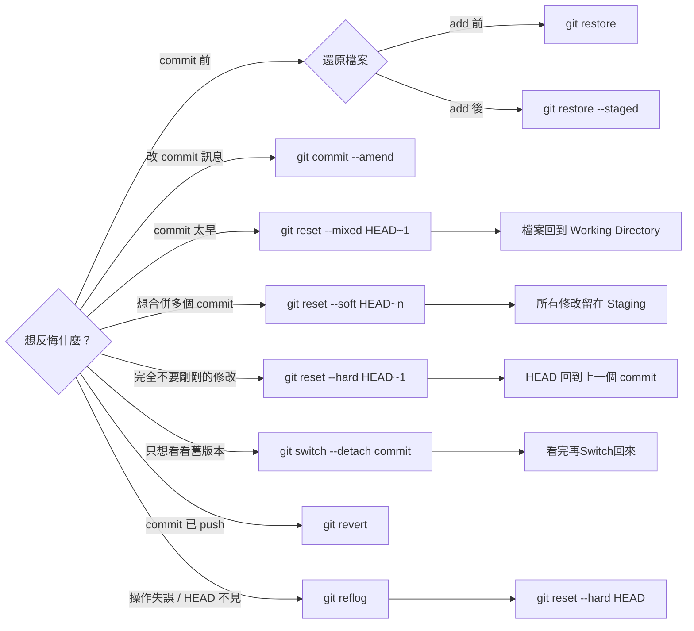

# Git 時光機

這份文件是一張 **Git 時光機對照表**，目的只有一個：

> **當你做錯 Git 操作時，知道該坐哪台時光機。**

不是背指令，而是「情境 → 解法」。

---

## Git 最重要的觀念

> **只要 commit 還在，幾乎都救得回來。**

真正危險的只有兩種情況：

* `git reset --hard`
* `git push --force` 強制

但就算這樣，也還有機會（靠 `reflog`）。

---

## 後悔藥速查表（最常用）



| 情境 / 你後悔的是…        | 使用指令                           | 影響範圍              | 說明                               |
| ------------------ | ------------------------------ | ----------------- | -------------------------------- |
| 還沒 `git add`，想還原檔案 | `git restore <file>`           | Working Directory | 丟棄尚未加入暫存區的修改                     |
| 已 `git add`，想退回修改  | `git restore --staged <file>`  | Staging Area      | 將檔案從暫存區移回工作目錄                    |
| Commit 訊息寫錯        | `git commit --amend`           | HEAD              | 修改**最後一次 commit**（不新增 commit）    |
| Commit 太早，想再改一下    | `git reset --mixed HEAD~1`     | HEAD / Index      | Commit 消失，檔案回到 Working Directory |
| 想合併多個 commit       | `git reset --soft HEAD~n`      | HEAD              | Commit 消失，所有修改保留在 Staging        |
| 完全不要剛剛的修改          | `git reset --hard HEAD~1`      | 全部                | **危險**：Commit + 檔案修改全部消失         |
| 只想看看舊版本            | `git switch --detach <commit>` | HEAD              | 進入 Detached HEAD，不影響分支           |
| Commit 已經 push     | `git revert <commit>`          | 新 Commit          | 安全反悔，產生一個「反向 commit」             |
| 操作失誤 / HEAD 不見     | `git reflog`                   | 紀錄                | 查詢 HEAD 歷史，找回消失的 commit          |
| 找回後直接回到該狀態         | `git reset --hard <hash>`      | HEAD              | 回到 reflog 中的任一狀態                 |

---

## 1️⃣ commit message 打錯

### 情境

* 剛 commit 完發現訊息寫錯
* 還沒 push

### 解法（最安全）

```bash
git commit --amend -m "修正訊息"
```

* 只修改最後一個 commit
* 不改內容、不改歷史結構

---

## 2️⃣ Commit 太早，想重新選檔案再Commit

```bash
#回到上個Commit
git reset HEAD~1
#等同 git reset --mixed HEAD~1 
```

效果：

* commit 消失
* 檔案回到 Working Directory
* 修改過的檔案都還在

📌 常用於：

* 忘了加檔案
* 加了不該加的檔案


```bash
# 另一種作法 , 你可能在網路上看到有人這樣做
git add .
git commit --amend -m "修正訊息"
```
與上方 reset HEAD~1有何不同?

| 比較項目        | `commit --amend` | `reset HEAD~1` |
| ----------- | ---------------- | -------------- |
| 會不會刪 commit | ❌                | ✅              |
| commit 數量   | 不變               | -1             |
| HEAD 移動     | 留在最新             | 回到上一個          |
| 修改內容        | 直接併入             | 回到工作區          |
| hash 會變     | ✅                | N/A            |
| 心智模型        | 修正               | 拆掉             |
| 常見用途        | 補檔案、改訊息          | 重來一次           |

---

## 3️⃣ 想把前N個 commit 合併成一個

```bash
git reset --soft HEAD~3
git commit -m "one clean commit"
```

📌 適合：
* 最近幾次 commit 修改幅度太小, 想重新包成一個Commit
* commit 太多次無用訊息?
* 發 PR / MR 前整理 commit

---

## 4️⃣ 不小心把檔案 git add 了

```bash
git restore --staged file.txt
```

* 只影響 Staging Area
* 檔案內容不會消失

---

## 5️⃣ 檔案改壞了，想全部丟掉

```bash
git restore file.txt
```

或整個專案：

```bash
git restore .
```

⚠️ 未 commit 的修改會消失

---

## 6️⃣ commit 已經 push 出去了（⚠️ 重點）

### ❌ 不要做

```bash
git reset --hard
git push --force
```

### ✅ 正確做法

```bash
git revert <commit-id>
```

* 產生一個「反向 commit」
* 不破壞歷史
* 團隊安全

---

## 7️⃣ reset --hard 後後悔了（救命）

```bash
git reflog
```

找到你要的 commit：

```bash
git reset --hard <commit-id>
```

📌 `reflog` 是 Git 的黑盒子紀錄

---

## 8️⃣ pull 之後整個亂掉

```bash
git reflog
git reset --hard ORIG_HEAD
```

* 回到 pull 前狀態

--- 
### Reset 三兄弟

| 指令      | commit | 檔案 | staged  | 狀況                        | 
| --------- | ------ | ---- | ------ |----------------------------| 
| `--soft`  | ❌     | ✅  | ✅     |commit 訊息錯，但內容還要  | 
| `--mixed` | ❌     | ✅  | ❌     |commit 太早 想重新 add     | 
| `--hard`  | ❌     | ❌  | ❌     |全部不要回到過去           | 

```bash
#後悔 commit，但內容還要
git reset --soft HEAD~1

#後悔 commit + 想重新 add
git reset HEAD~1
git reset --mixed HEAD~1

#全部不要了，回到過去
git reset --hard HEAD~1
```


* 預設`--mixed`模式 :不帶參數的預設使用,基本上回到上個 commit可以放心使用
* 禁用`--hard`狀況  :已push專案(團隊), 對整個 Commit Graph 影響

下面Commit Graph 經過`--hard`差異, 
可以看到 C 整個不見(雖然還存在於reflog), 但如果繼續開發又push, 就會發現C整個不見

A --- B --- C   (HEAD)
`git reset --hard HEAD~1`
A --- B   (HEAD)
`繼續開發後Push?`
A --- B --- D  (HEAD)
`C 已經完全消失 Commit line`

---

## reset / revert / restore 怎麼選？

| 指令      | 改歷史 | 安全性 | 常用時機   |
| ------- | --- | --- | ------ |
| reset   | ✅   | ❌   | 本機整理   |
| revert  | ❌   | ✅   | 已 push |
| restore | ❌   | ✅   | 檔案層級   |

---

## 新手保命三守則

1. **還沒 push 前，reset 很自由**
2. **已 push，一律先想 revert**
3. **不確定時先 reflog**

---

📘 一句話總結

> **Git 不怕你做錯，只怕你不知道怎麼救。**

