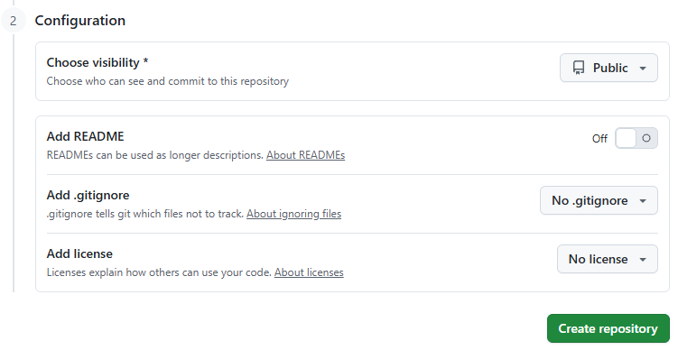
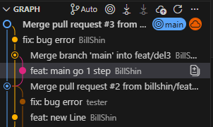

### Why Git Remote Repository?

- 為了協作
- 為了備份
- 為了分享

Remote repository 是「多人共用的 commit 歷史來源」

### 常用的協作庫

- GitHub
- GitLab    - (可使用docker自行建立,適合公司內部控管)
- BitBucket


### 指令 & 用途

接下來會用到的指令

remote > local (下行)
* `fetch` = 只更新遠端狀態（origin/*），不影響本地開發
* `clone` = 第一次把整個 repo 搬到本地
* `pull`  = 把遠端變化實際整合進目前分支（fetch + merge/rebase）

local > remote (上行)
* `push` = 將本地的branch推送到remote


### 建立 Remote Repository

本地有 完成/正在協作開發 的專案的時候

 * 確定本地`README.md` 已存在(專案介紹,如何使用等...)
 * `git status` 狀態為 clean

於 GitHub / GitLab 上 建立空的專案 , `README.md` 選擇不要建立




### 將專案推送到 GitHub

使用以下指令 , 至於推送的位置就看開完後的專案給的教學範例連結

以下為GitHub的範例 , 照著做即可完成第一次push!
```bash
#加入遠端專案
git remote add origin https://github.com/{user}/{repo}.git

#如果本來就在main 就不用這步
git branch -M main

#第一次push
git push -u origin main
```

接著 github /gitlab 網頁上就有你的東西了!!

### 新手問題!建立`README.md`會發生什麼?
 Remote 端直接產生一個 `README.md` 檔案, **並建立第一個Commit!!!**
 結果本地無法push,why?

 ```mermaid
flowchart TD
    A[New Repo] --> B{Add README.md?}

    B -- Yes --> C[Remote has first commit]
    C --> |Remote端開始|D[git clone]

    B -- No --> E[Remote is empty]
    E --> |Local端開始|F[git init & commit]
    F --> G[git push origin main]

 ```

也就是為什麼第一次新增專案`Add README.md`後不能push的原因
因為Remote端**已經存在一個Commit!!** ,所以就跟本地的狀態不一樣打架了!
不想再重新建立Repo的話,也只能force push(**往後禁用**)

```bash
git push -u origin main -f
#注意： -f (force) 會直接刪除遠端那個 README 的歷史，以本地為準。
```

### 已有遠端專案,開始協作?
或是想要下載回來看看
```bash
#注意一下指令起始位置, clone 後會於此位置下建立Repo資料夾
git clone https://github.com/{user}/{repo}.git
```

### 單人開發? - push main

單人開發,不需要進行多人協作的狀況, 
不管當中開了多少branch ,最後也有merge branch 到 main
local 端最後確認 main status clean 就可以push

### 多人開發? - Push Branch ?

一開始開發都是使用 main 進行push 
push main 以外的 branch 就會觸發...
* Github - PR
* Gitlab - MR

Why? 這其實已經開始進入多人協作的狀態了
多人協作的時候,就是把remote clone / pull 回來, 開branch後進行開發 ,
最後push branch上去

接著
PR/MR 觸發之後 Repo owner 就得到網頁上去進行review & merge 
完成之後才會在 **Remote端進行合併**

注意! 這時候 local 端的 main branch 已經落後了
後續要進行再開發的時候 , 需要先把 main 更新到與 remote 端一樣

```bash
git switch main
git pull origin main
```

> 至於push保護設定,就不於本文說明 (各平台有自己設定方式,而且我也不會~)

### Remote 端進度為主的開發

開工前,先確認一下remote狀況,

```bash
git fetch origin
```
這動作 VSCode 會自動執行, 所以 VSCode 不是用什麼魔法知道你remote端有新的進度


或是直接查詢log
```bash
git log --oneline --graph
```


新branch開工前檢查本地main狀態 (免得到後還得處理衝突狀態)

```bash
git switch main
git fetch                   # 抓遠端最新
git status                  # 看是否落後
# 若落後
git pull                    # 拉回最新main
git switch -c feature/xxx   # 開始新branch開發
```


### 本地main(dev)已經落後 , 如何處理正在開發中的 branch ?

main 跑太快, 自己的branch 卻還在開發中?

原則上就是先把目前開發中branch先Commit, 保留最後狀態
接著把main切回來 , 更新到與Repo上一樣的進度
再切回原本開發中的branch
(但可能會遇到merge 衝突處理)

```Mermaid
flowchart TD

    A[先檢查目前Branch<br> git status ] --> B{working tree clean ?}

    B -- 否 --> C[先commit 目前進度]
    B -- 是 --> D[git switch main]

    C --> D[git switch main]
    D --> E[git pull origin main]

    E --> F[git switch feature/xxx]
    F --> G[git merge main]

```
> 但如果 main 的推進與你無關, 就不用擔心繼續開發 , 直到最後push branch 即可

### 為什麼有時候看到 pull/push/fetch 不需要其他參數? - upstream

upstream 是什麼？
local branch → 預設要跟哪個 remote branch 同步

```bash
#查看目前的 branch 與遠端的關聯
git branch -vv
```

通常是 push 的時候順便設定的

```bash
#使用 -u 設定設定up
git push -u origin main

#往後 main 可以直接
git push

```

手動設定branch 的 upstream

```bash
#確認目前的 branch,
git switch main
#使用 -u 設定remote upstream
git branch -u origin/main
```

只要設定過的 branch , 就可以直接 pull/push/fetch 不帶參數執行 方便很多