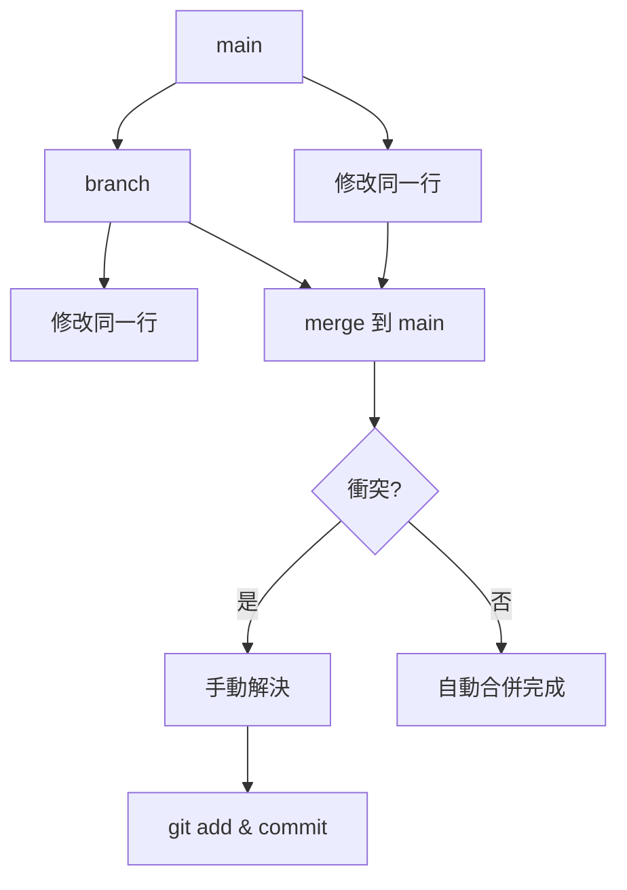

# Git 衝突管理教學（單人模式）

> 目的：在單人開發中安全處理衝突，保持 main 歷史乾淨。

---

## 1️⃣ 衝突是什麼？

衝突 = Git 無法自動合併你的修改。

常見原因：

* 同一行改了不同內容
* 一個 commit 刪掉，另一個修改了
* branch 太久沒合併

單人模式例子：

* main 改了一行
* branch 也改了同一行 → 合併時觸發衝突

---

## 2️⃣ 觸發衝突示例

```bash
# main 修改一行並 commit
git commit -am "fix: update config"

# 建立 branch
git checkout -b experiment

# branch 同一行改
git commit -am "feat: change config for experiment"

# 回 main，合併 branch
git checkout main
git merge experiment
```

Git 會提示：

```text
CONFLICT (content): Merge conflict in config.txt
Automatic merge failed; fix conflicts and then commit the result.
```

git status 此時會也會提示那些檔案需要手動整合：
```bash
On branch main
You have unmerged paths.
  (fix conflicts and run "git commit")
  (use "git merge --abort" to abort the merge)

Unmerged paths:
  (use "git add <file>..." to mark resolution)
        both modified:   test1.txt

no changes added to commit (use "git add" and/or "git commit -a")
```
---

## 3️⃣ 衝突處理步驟

### Step 1：檢查衝突檔案

```bash
git status
```

### Step 2：打開衝突檔案

```text
<<<<<<< HEAD
main 的內容
=======
branch 的內容
>>>>>>> experiment
```

### Step 3：手動編輯整合

```text
main 與 feature 整合後的內容
```

核心原則：最後檔案裡不可以有 Git 標記 (<<<<<<<, =======, >>>>>>>)。

### Step 4：標記完成並 commit

```bash
git add config.txt
git commit -m "fix: resolve merge conflict in config.txt"
```

---

## 4️⃣ Mermaid 流程圖



---

## 5️⃣ 小技巧

* 衝突不要慌，Git 保留兩邊內容
* 先看 `git status` 再操作
* branch 保持短小 → 減少衝突
* branch 試驗，main 保持可跑

---

## 6️⃣ 心法

> 衝突不是錯，Git 只是提醒你「需要人工決定哪一版對」

