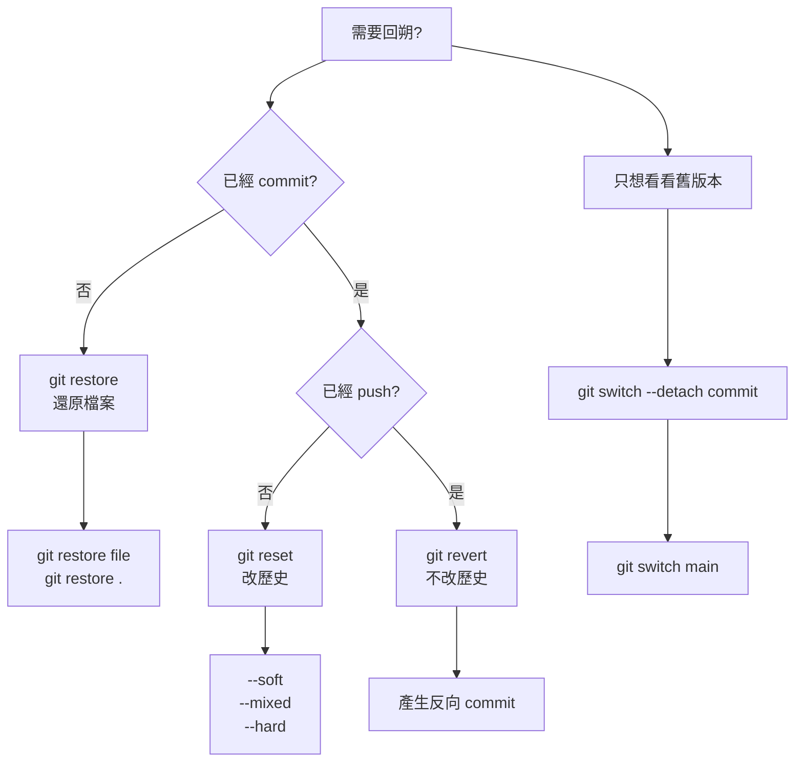
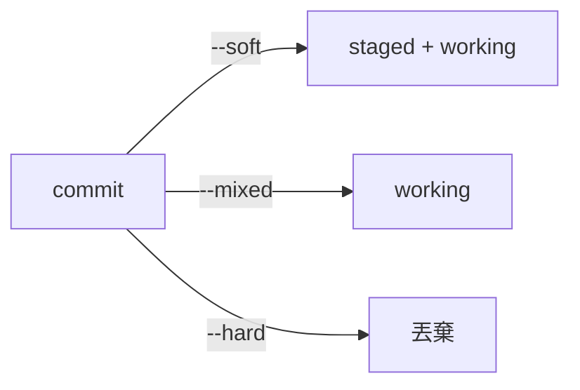

# Git 回朔（Rollback）完整筆記模板

> 目的：在 **不慌、不亂、不毀歷史** 的前提下，安全回到正確狀態。

---

## 🧠 一句話總結

> **有沒有 commit？有沒有 push？**
>
> 這兩個問題，決定你該用哪一個回朔指令。

---

## 🗺️ 回朔決策流程圖



---

## 1️⃣ 尚未 commit 的回朔（最常用）

### 🎯 使用時機

* 檔案改壞
* 想放棄這次修改,回到commit前的狀態

### 指令

```bash
git restore file.txt      # 還原單一檔案
git restore .             # 還原全部
```

### 已 add 但後悔

```bash
git restore --staged file.txt
git restore --staged .
```

📌 特性：

* 不影響 commit 歷史
* 最安全

---

## 2️⃣ 回到舊 commit「看看」（不改歷史）

### 🎯 使用時機

* 想看舊版本內容
* Debug

```bash
git log --oneline
git switch --detach <commit_hash>
```

回來：

```bash
git switch main
```

📌 特性：

* detached HEAD
* 不屬於任何 branch

---

## 3️⃣ reset：回到過去並重來（⚠️ 改歷史）

### 🎯 使用時機

* 單人
* 尚未 push

### reset 三兄弟


| 指令       | 狀況 | 一句話                     |
| --------- |----| ----------------------- |
| `--soft`  |commit 訊息錯| **後悔 commit，但內容還要**     |
| `--mixed` |commit 太早 | **後悔 commit + 想重新 add** |
| `--hard`  |全部不要| **全部不要了，回到過去**          |

| 指令      | commit | 檔案 | staged |
| ------- | ------ | -- | ------ |
| --soft  | ❌      | ✅  | ✅      |
| --mixed | ❌      | ✅  | ❌      |
| --hard  | ❌      | ❌  | ❌      |




### 範例

```bash
git reset --soft HEAD~1
git reset --mixed HEAD~1
git reset --hard HEAD~1
```


⚠️ 團隊專案請避免使用 `--hard`

---

## 4️⃣ revert：團隊安全撤銷

### 🎯 使用時機

* commit 已 push
* 不能改歷史

```bash
git revert <commit_hash>
```

📌 特性：

* 產生新 commit
* 抵消舊 commit
* 歷史完整保留

---

## 5️⃣ reflog：後悔藥（救命用）

### 🎯 使用時機

* reset 後發現後悔

```bash
git reflog
```

找回：

```bash
git reset --hard <reflog_hash>
```

📌 reflog 是「本地安全網」

---

## 🧪 建議練習流程

```bash
echo "bad" >> test.txt
git commit -am "bad commit"

git reset --hard HEAD~1
```

再用 reflog 救回：

```bash
git reflog
git reset --hard <hash>
```

---

## ❌ 常見錯誤

* 已 push 還用 reset
* 不知道自己在 detached HEAD
* 濫用 --hard

---

## 🟢 心法總結

> reset 是時光倒流
> revert 是更正公告
> restore 是後悔還沒發生

---

## 📎 延伸

* VS Code Git UI 回朔
* Git Flow / Trunk-Based 對回朔的影響
* CI 下禁止 reset 的原因
